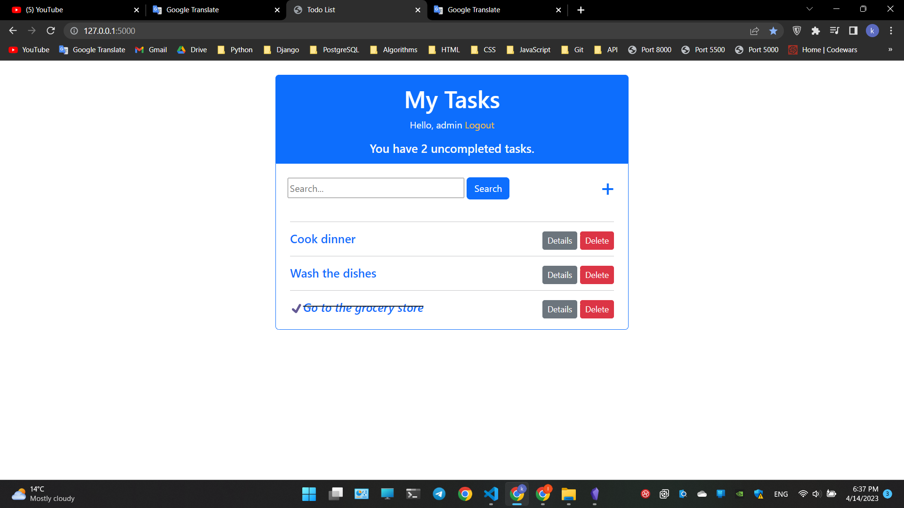

# TodoList - Flask site with Bootstrap

Hi, this is my first fully-functional flask project with bootstrap.



## Table of contents
* [General info](#general-info)
* [Features](#features)
* [Technologies](#technologies)
* [Running the project](#running-the-project)

## General Info

It's my first project made without tutorial - TodoList. With this project i've learned how Flask works, its basic concepts - views, models, forms; work with templates, SQLAlchemy. I've made a project structure very similar to Django.

## Features

- Anyone can create his own account
- Create your tasks to not forget about important things
- Mark a task if you've done it already
- Look how many uncompleted tasks you have
- Update and delete tasks
- Tasks search

## Technologies

- Python 3.10.6
- Flask==2.2.2
- Flask-Bcrypt==1.0.1
- Flask-Login==0.6.2
- Flask-SQLAlchemy==3.0.2
- Flask-WTF==1.0.1
- Jinja2==3.1.2
- SQLAlchemy==1.4.44
- WTForms==3.0.1
- Bootstrap 4
- HTML5
- CSS3

## Running the project

There is 1 created account already, so if you want to check it out without registration:

*login*: **admin**
*password*: **admin**

At first, you should have installed Python on your computer. Not necessary, but advised to create a virtual environment, so you store your project's dependecies apart for avoiding conflicts beetwen packages.
```shell
pip install virtualenv
```
Clone this repository and open it in any text editor. To create virtualenv, run the command below in a Windows terminal:
```shell
python -m venv venv
```
or if you're on Linux or Mac:
```shell
virtualenv env
```
To activate virtualenv, run
```shell
venv\Scripts\activate.bat
```
Linux or Mac
```shell
source env/bin/active
```
Than install project dependencies
```shell
pip install -r requirements.txt
```
Now you can run the project on local server (default port - 5000):
```shell
python views.py
```
